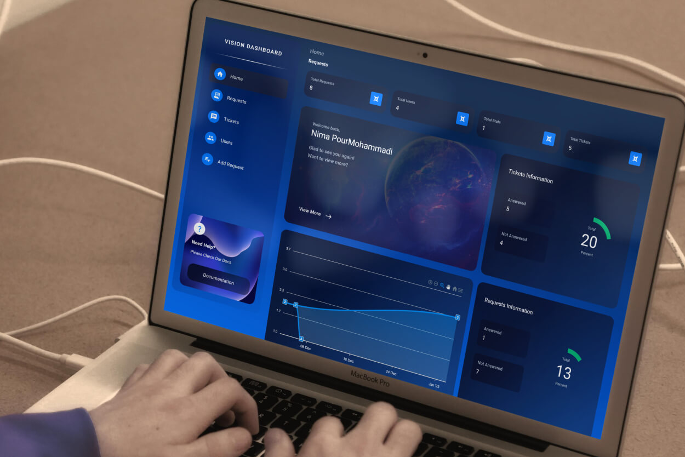

# Vision-Dashboard - [Demo](https://nimaprmdi.github.io/vision-dashboard/)

Vision-Dashboard is a Dashboard app using TypeScript, React, Axios and other related technologies.



## Features

-   Sass for stylesheets
-   Connected to the Hygraph API
-   Responsive design
-   Cross-browser compatibility
-   Developer friendly extendable code
-   SEO optimized
-   GNU GPL version 3.0 licensed
-   …and much more

See a working example at [nimaprmdi.github.io/Vision-Dashboard/](https://nimaprmdi.github.io/vision-dashboard/).

## installation

1.  Clone the project into wanted destination location using `git clone https://github.com/nimaprmdi/Vision-Dashboard.git`
2.  Run command `npm install`
3.  Run command `npm build`
4.  You Will find production build in <b>build</b> folder

## Theme structure

```shell
/Vision-Dashboard/               # → Root of your theme
│── .vscode/                     # → VSCode settings.json file
│── public/                      # → Theme public folder including structure files
│── src/                         # → Theme internal source files
│   ├── assets/                  # → Theme Assets files
│   ├── components/              # → The constructed TSX components required for the interface
│   ├── hooks/                   # → The custom hooks used to build extra functionalities
│   ├── model/                   # → The navigation object which construct menu
│   ├── services/                # → API handling services and related queries
│   └── store/                   # → Redux handled store
├── .gitignore/                  # → Ignoring unwanted files
├── tsconfig.json/               # → Configuration for the TypeScript
├── package.json                 # → Dependencies and scripts
├── package-lock.json            # → Locked dependencies with the installed version
├── node_modules/                # → Node.js packages
```

## Theme development

-   Run `npm install` from the theme directory to install dependencies
-   Run `npm start` and have fun

## License

Vision-Dashboard is licensed under [GNU GPL Version 3](https://www.gnu.org/licenses/gpl-3.0.en.html).

## Assets & Licensing

Icons by Iconify (React)
License: MIT, https://raw.githubusercontent.com/phosphor-icons/phosphor-home/master/LICENSE
Source: https://iconify.design/

TypeScript by Microsoft
License: GNU GPLv2, https://opensource.org/licenses/GPL-2.0
Source: https://www.typescriptlang.org/

Toast Notification by react-toastify
License: MIT, https://raw.githubusercontent.com/phosphor-icons/phosphor-home/master/LICENSE
Source: https://fkhadra.github.io/react-toastify/introduction/

## Developer Notes

-   I would like to thank everybody in the open-source community
-   If There was any issues Please submit pull requests
